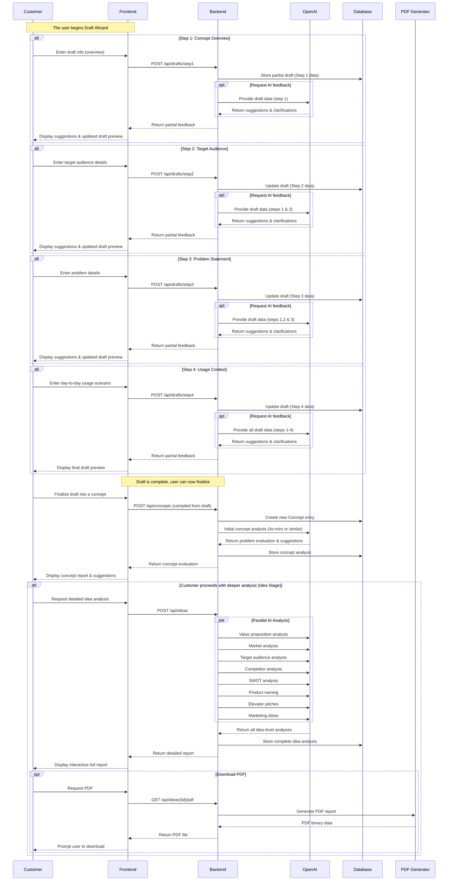

# Draft Stage Diagram

Below is an **extended Mermaid sequence diagram** that illustrates the entire flow with a **four-step draft wizard**, partial calls to OpenAI for suggestions, and ultimately transitioning into the **Concept** and **Idea** stages. It shows how each step of the draft is saved, possibly enhanced by AI feedback, and then finalized into a concept for validation. If needed, the user proceeds to deeper “idea” analysis and can generate a PDF at the end.

## Diagram Explanation

1. **Draft Wizard (Steps 1–4)**

   - The user moves through four sequential steps:
     1. **Concept Overview**
     2. **Target Audience**
     3. **Problem Statement**
     4. **Usage Context**
   - After each step, the frontend sends the updated partial draft to the backend, which stores it in the database.
   - Optionally, the backend can call OpenAI (the cheaper model) to get immediate suggestions or clarifications.
   - The user sees feedback in real-time, refining their draft until it’s complete.

2. **Finalizing the Draft Into a Concept**

   - Once all steps are completed, the user clicks “Finalize” (or similar).
   - The combined draft data is posted to `POST /api/concepts` to create a **Concept** record in the database.
   - The backend calls OpenAI again for an initial concept analysis (classification, suggestions, clarity scores, etc.).
   - The system returns an evaluation report to the frontend, where the user can see if their concept is “well-defined” or needs further refinement.

3. **Idea Stage (Advanced Analysis)**

   - If the user wants more in-depth research or advanced insights (e.g., competitor analysis, market sizing), they proceed with the **Idea** stage.
   - The backend issues multiple, parallel AI calls (potentially to a more expensive model) for specific analyses (market, target audience, product naming, etc.).
   - The user receives a comprehensive **full report** once everything is compiled.

4. **PDF Generation**
   - Optionally, the user can download a PDF of the full report at the Idea stage.
   - The backend calls a PDF generator service, returns the binary, and the frontend provides the file to the user.

### Key Takeaways

- Each wizard step can incorporate **on-the-fly** AI suggestions.
- You only do the more **expensive** or detailed analysis once the concept is clarified.
- This **staged** approach ensures higher-quality data and saves on API costs.
- The user’s experience is more **guided** and less prone to confusion or incomplete inputs.
