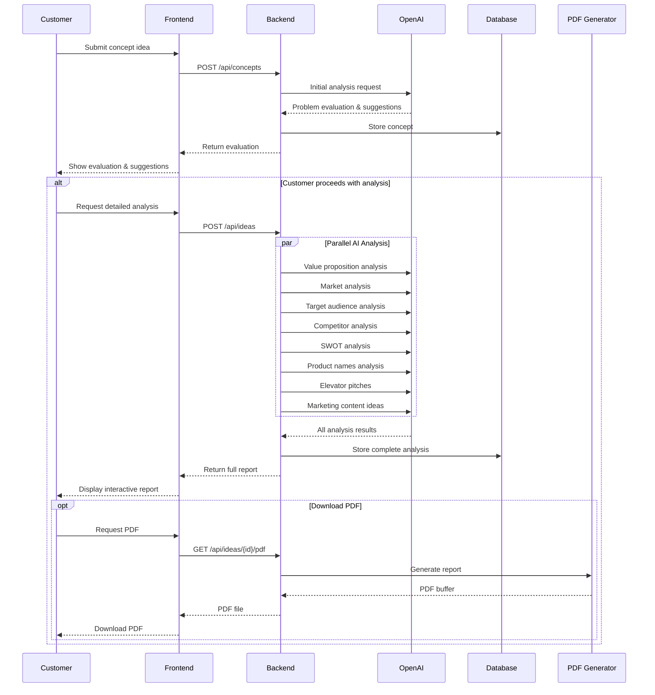

# CheckMVP Product Requirements Document

## 1. Introduction

### 1.1 Purpose

CheckMVP is an AI-powered platform designed to help startup founders, developers, and indie hackers validate their product ideas before investing significant time and resources into development. It serves as an unofficial co-founder, providing structured analysis and actionable insights.

### 1.2 Target Users

- Early-stage startup founders
- Independent developers (indie hackers)
- Product managers
- Digital entrepreneurs
- First-time founders

### 1.3 Key Features

- Idea validation and refinement
- Market analysis and competitor research
- Target audience identification
- Value proposition development
- SWOT analysis
- Marketing strategy suggestions
- PDF report generation

## 2. System Architecture

### 2.1 Technology Stack

- Frontend: Next.js with TypeScript
- Styling: Tailwind CSS
- PDF Generation: @react-pdf/renderer
- Analytics: Plausible
- Error Tracking: Sentry
- Database: Prisma with SQLite
- Caching: Redis

### 2.2 Core Components

1. Concept Analysis Engine
2. PDF Report Generator
3. Market Analysis System
4. Content Strategy Generator
5. User Interface Components

## 3. Feature Specifications

### 3.1 Idea Validation

- Problem statement evaluation
- Market existence verification
- Pain points identification
- Recommendations for improvement
- Actionable suggestions

### 3.2 Market Analysis

- Industry trends analysis
- User behavior insights
- Market gaps identification
- Innovation opportunities
- Strategic direction recommendations

### 3.3 Target Audience Analysis

- Audience segment identification
- Detailed persona development
- Pain point mapping
- Targeting strategies
- User acquisition suggestions

### 3.4 Competitor Analysis

- Competitor identification
- Feature comparison
- Strengths and weaknesses analysis
- Differentiation opportunities
- Market positioning suggestions

### 3.5 Product Strategy

- Value proposition development
- Product naming suggestions
- SWOT analysis
- Elevator pitch generation
- Google Trends keyword analysis

### 3.6 Marketing Strategy

- Content marketing ideas
- Social media campaign suggestions
- Platform-specific recommendations
- Growth strategy development
- Early adopter acquisition tactics

### 3.7 PDF Report Generation

- Comprehensive analysis report
- Actionable insights
- Visual presentation
- Downloadable format
- Structured sections

### 3.8 AI Analysis Components

- **Problem Evaluator**

  - Initial problem statement validation
  - Clarity assessment
  - Scope verification
  - Market fit evaluation
  - Refinement suggestions

- **Value Proposition Evaluator**

  - Main benefit identification
  - Problem-solution fit analysis
  - Differentiation strategy
  - Market positioning assessment
  - Unique selling points definition

- **Market Analysis Evaluator**

  - Industry trend identification
  - User behavior pattern analysis
  - Market gap detection
  - Innovation opportunity mapping
  - Strategic direction formulation

- **Target Audience Evaluator**

  - Segment identification and validation
  - Pain point analysis
  - User journey mapping
  - Acquisition channel suggestions
  - Engagement strategy development

- **Competitor Analysis Evaluator**

  - Market player identification
  - Feature matrix development
  - Strength/weakness assessment
  - Differentiation opportunity analysis
  - Positioning strategy recommendations

- **SWOT Analysis Evaluator**

  - Strength identification
  - Weakness assessment with action items
  - Opportunity mapping
  - Threat analysis with mitigation strategies
  - Strategic recommendations

- **Product Names Evaluator**

  - Name generation based on context
  - Domain availability check
  - Brand potential assessment
  - Target audience alignment
  - Similar names analysis

- **Social Media Campaigns Evaluator**
  - Platform-specific content strategy
  - Short-form content suggestions
  - Long-form content planning
  - Video content scripting
  - Campaign timing recommendations

## 4. User Experience

### 4.1 User Flow

1. Submit product idea
2. Receive initial evaluation
3. Get detailed analysis
4. Download PDF report
5. Access additional resources

### 4.2 Interface Requirements

- Clean, intuitive design
- Mobile-responsive layout
- Dark mode support
- Easy navigation
- Clear section organization

## 5. Future Enhancements

### 5.1 Planned Features

- Two-week testing plan generator
- Cost estimation tools
- Networking opportunities finder
- Pitch deck generator
- Project roadmap creator

### 5.2 Technical Improvements

- Enhanced AI capabilities
- Additional export formats
- Integration with external tools
- Performance optimizations
- Advanced analytics

## 6. Technical Requirements

### 6.1 Performance

- Page load time < 3 seconds
- PDF generation < 5 seconds
- Responsive UI across devices
- Efficient data processing
- Optimal caching strategy

### 6.2 Security

- Data encryption
- Safe PDF generation
- API rate limiting
- Error handling
- Input validation

### 6.3 Scalability

- Modular architecture
- Efficient database design
- Caching implementation
- Resource optimization
- Load handling

### 6.4 API Endpoints

#### Concept Analysis

- `POST /api/concepts`
  - Request: { problem: string }
  - Response: { id: string, evaluation: ProblemEvaluation }

#### Detailed Analysis

- `POST /api/ideas`
  - Request: { conceptId: string, problem: string }
  - Response: { id: string, analysis: CompleteAnalysis }

#### PDF Generation

- `GET /api/ideas/{id}/pdf`
  - Response: PDF Buffer

### 6.5 Error Handling

- **Input Validation Errors**

  - Problem statement length limits
  - Required field validation
  - Format verification

- **AI Service Errors**

  - OpenAI API timeout handling
  - Rate limit management
  - Response validation
  - Fallback strategies

- **System Errors**
  - Database connection issues
  - Cache management
  - PDF generation failures
  - API endpoint failures

### 6.6 Monitoring

- **Performance Metrics**

  - API response times
  - AI service latency
  - PDF generation duration
  - Database query performance

- **Error Tracking**

  - Sentry integration
  - Error categorization
  - Alert thresholds
  - Resolution tracking

- **Usage Analytics**
  - User engagement metrics
  - Feature usage statistics
  - Conversion rates
  - Retention metrics

## 7. Success Metrics

### 7.1 Key Performance Indicators

- User engagement rate
- Report completion rate
- PDF download rate
- User retention
- Feature adoption rate

### 7.2 Quality Metrics

- System uptime
- Error rate
- User satisfaction
- Report accuracy
- Response time

## 8. Development Guidelines

### 8.1 Code Standards

- TypeScript strict mode
- ESLint configuration
- Prettier formatting
- Jest testing
- Component documentation

### 8.2 Development Process

- Feature branching
- Pull request reviews
- Automated testing
- Continuous integration
- Version control

## 9. Maintenance

### 9.1 Regular Tasks

- Database maintenance
- Performance monitoring
- Error tracking
- Feature updates
- Security patches

### 9.2 Documentation

- Code documentation
- API documentation
- User guides
- Contribution guidelines
- Release notes

## 10. Support

### 10.1 User Support

- GitHub issues
- Twitter communication
- Email support
- Documentation
- Community engagement

### 10.2 Developer Support

- Contributing guidelines
- Development setup
- Testing procedures
- Deployment process
- Code review guidelines

## 11. Process Flow

### 11.1 Core Flow Diagram

### 11.2 Process Description

1. **Initial Concept Submission**

   - Customer submits their product idea through the web interface
   - System performs initial validation and problem statement analysis
   - Customer receives immediate feedback on concept clarity

2. **Problem Refinement**

   - If needed, system suggests improvements to problem statement
   - Customer can refine their concept or choose from suggestions
   - System ensures problem is well-defined before proceeding

3. **Comprehensive Analysis**

   - Upon customer confirmation, system initiates parallel analysis:
     - Value proposition development
     - Market analysis and trends
     - Target audience identification
     - Competitor landscape
     - SWOT analysis
     - Product naming suggestions
     - Marketing strategy recommendations
     - Content ideas generation

4. **Report Generation**
   - System compiles all analyses into interactive web report
   - Customer can explore different sections
   - PDF version available for download
   - Report includes actionable insights and next steps

### 11.3 Technical Integration Points

1. **Frontend-Backend Communication**

   - REST API endpoints for all operations
   - Real-time status updates for long-running analyses
   - Error handling and retry mechanisms

2. **AI Integration**

   - OpenAI API for all analysis components
   - Parallel processing for efficiency
   - Result validation and formatting

3. **Data Persistence**

   - Concept and analysis storage in database
   - PDF report caching
   - User session management

4. **Report Generation**
   - Web-based interactive report
   - PDF generation using @react-pdf/renderer
   - Consistent styling across formats

## 12. Risk Management

### 12.1 Technical Risks

- AI Service Dependency

  - Risk: OpenAI API downtime or rate limiting
  - Mitigation: Implement fallback AI providers (e.g., Anthropic, Cohere)
  - Mitigation: Local queue system for retry mechanisms

- Data Privacy & Security
  - Risk: Sensitive business ideas exposure
  - Mitigation: End-to-end encryption for stored concepts
  - Mitigation: Data retention policies and automatic purging

### 12.2 Business Risks

- Cost Management

  - Risk: Unpredictable AI API costs
  - Mitigation: Implementation of usage quotas
  - Mitigation: Caching strategy for similar queries

- Market Risks

  - Risk: Competitor platforms emergence
  - Mitigation: Unique feature differentiation
  - Mitigation: Rapid iteration capability

  ## 13. Service Level Agreements

### 13.1 System Availability

- 99.9% uptime guarantee
- Planned maintenance windows
- Incident response times:
  - Critical: 1 hour
  - High: 4 hours
  - Medium: 24 hours
  - Low: 48 hours

### 13.2 Performance Metrics

- API Response Times:
  - 95th percentile < 500ms
  - 99th percentile < 1000ms
- PDF Generation: < 5 seconds for 90% of requests
- Analysis Generation: < 30 seconds for complete analysis

## 14. Data Management

### 14.1 Data Retention

- User Data: 24 months
- Analysis Results: 12 months
- System Logs: 6 months
- Audit Trails: 36 months

### 14.2 Compliance Requirements

- GDPR Compliance
  - Data export functionality
  - Right to be forgotten implementation
  - Privacy policy requirements
- CCPA Compliance
- SOC 2 Compliance Requirements

## 15. Infrastructure Specifications

### 15.1 Cloud Architecture

- Primary Provider: AWS/GCP/Azure
- Region Strategy: Multi-region deployment
- Backup Strategy: Cross-region replication
- CDN Implementation: CloudFront/Cloudflare

### 15.2 Development Environments

- Development
- Staging
- QA
- Production
- Disaster Recovery

### 15.3 CI/CD Pipeline

- Build Process
- Testing Stages
- Deployment Strategy
- Rollback Procedures

## 16. Testing Requirements

### 16.1 Test Types

- Unit Testing: 80% coverage minimum
- Integration Testing
- E2E Testing
- Performance Testing
- Security Testing
- AI Response Testing

### 16.2 Test Environments

- Test Data Management
- Synthetic Data Generation
- AI Training Data Sets
- Performance Testing Datasets

## 17. External Dependencies

### 17.1 Third-party Services

- OpenAI API
  - Version requirements
  - Fallback providers
  - Rate limits
- Domain Availability Checker
  - API specifications
  - Alternative providers
- Analytics Services
  - Data collection requirements
  - Privacy considerations

## 18. Implementation Phases

### 18.1 Phase 1 (MVP - 8 weeks)

- Core concept analysis
- Basic PDF generation
- Essential UI components

### 18.2 Phase 2 (12 weeks)

- Advanced analysis features
- Enhanced PDF reports
- API integrations

### 18.3 Phase 3 (16 weeks)

- Advanced features
- Mobile optimization
- Performance enhancements

## 19. Resource Requirements

### 19.1 Development Team

- 2 Frontend Developers
- 2 Backend Developers
- 1 DevOps Engineer
- 1 QA Engineer
- 1 Product Owner
- 1 UI/UX Designer

### 19.2 Infrastructure Costs

- Development: $2,000/month
- Staging: $1,500/month
- Production: $5,000/month
- AI API Costs: $0.50/analysis
