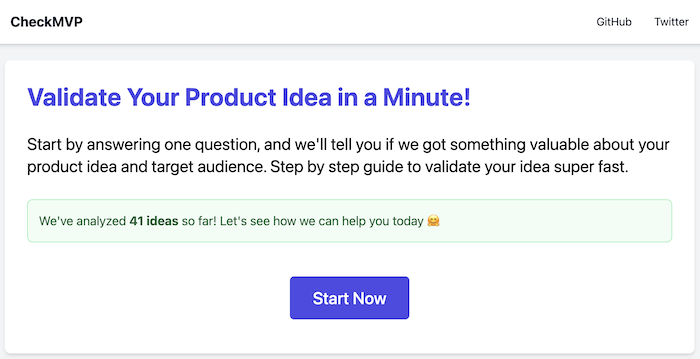
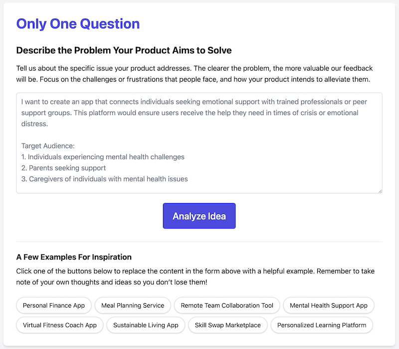

# Welcome to CheckMVP! 🎉

CheckMVP is a user-friendly tool designed to help aspiring entrepreneurs and developers validate their product ideas. Whether you're just starting out or refining your concept, our platform guides you through understanding your target audience, evaluating your problem, and much more!

## What Does CheckMVP Do?

- **Validate Your Idea**: Quickly assess if your product idea resonates with real users.
- **Target Audience Insights**: Get actionable suggestions on who your ideal users are and what challenges they face.
- **Market Analysis**: Understand the landscape of your product and identify potential competitors.
- **SWOT Analysis**: Gain a comprehensive view of your product's strengths, weaknesses, opportunities, and threats.
- **Get Inspired**: Use our curated examples to spark new ideas and refine your concept.

## How Does It Work?

1. **Submit Your Idea**: Tell us about the problem your product aims to solve and who your target audience might be.
2. **Get Instant Feedback**: Receive an analysis that includes insights on your idea, potential audiences, and market opportunities.
3. **Iterate & Improve**: Use the feedback to refine your product and validate your concepts with ease.

## Why CheckMVP?

We know that navigating the product development landscape can be challenging, especially for new developers and entrepreneurs. That's why CheckMVP is here to simplify the process and provide you with the support you need to turn your ideas into reality.

## Screenshots

## Join the Community

Your feedback matters! If you find CheckMVP helpful or have suggestions for improvement, let us know. You can reach out on [Twitter (X)](https://twitter.com/itmistakes_com) or open an issue on our GitHub repository.

## Getting Started

To start using CheckMVP, simply visit our [website](https://demo.checkmvp.com/) and start validating your ideas today!

## Contributing

We welcome contributions from everyone! If you'd like to help improve CheckMVP, check out our issues or feel free to fork the repository and submit a pull request.

## License

CheckMVP is open-source and available under the [MIT License](LICENSE).

---

Thank you for your interest in CheckMVP! We're excited to help you on your journey to validating and developing your product ideas. 🚀
